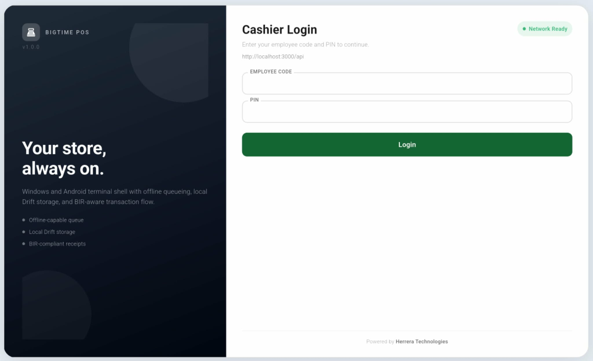
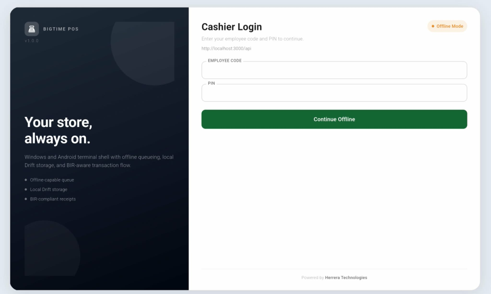

# BIGTIME POS

## Item 11 Compliance Sample

### Screenshot of the Online/Offline Indicator (if applicable)

Requirement covered:

"Screenshot of the Online/Offline Indicator (if applicable)."

Prepared on: April 14, 2026
System: BIGTIME POS

---

## Screenshot Evidence Used (User-Provided)

- Evidence ID: `ITEM11-ONLINE-01`
- Screen Type: **Log-In Screen (Cashier Login) - Online**
- Indicator shown: **Network Ready**

- Evidence ID: `ITEM11-OFFLINE-01`
- Screen Type: **Log-In Screen (Cashier Login) - Offline**
- Indicator shown: **Offline Mode**

## Compliance Statement for This Evidence Set

1. Online indicator screenshot attached: **YES** (`Network Ready`).
2. Offline indicator screenshot attached: **YES** (`Offline Mode`).
3. Both screenshots are from the same BIGTIME POS login screen context.
4. This file is prepared for Item 11 earmark in Annex B submission.

---

## Evidence A - Online Indicator

## Evidence B - Offline Indicator

